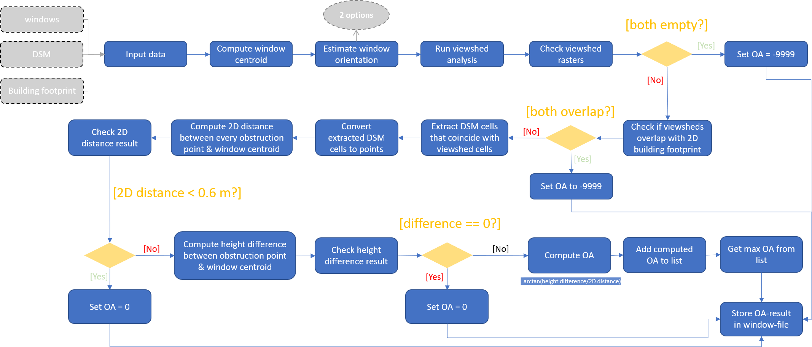

# OA-tool
The OA-tool computes the obstruction angle of rectangular windows placed on vertical surfaces of 3D buildings. The code is written in ArcPy and requires an installed version of ESRI ArcGIS Pro to run.   

 
 

## Input data:
- Windows (Multipatch feature layer)
- Digital Surface Model - DSM covering the entire extent of the study area (Raster layer)
- Building footprints (2D Feature layer)

 
 

## Output:
- The computed obstruction angle for every window is stored in a separate column of the attribute table of the window input dataset. Obstruction angles are stored in degrees.

 
 

## Workflow:

</img>

 
 

## License
GNU GENERAL PUBLIC LICENSE
Version 3, 29 June 2007
Copyright (C) 2007 Free Software Foundation, Inc. http://fsf.org/
